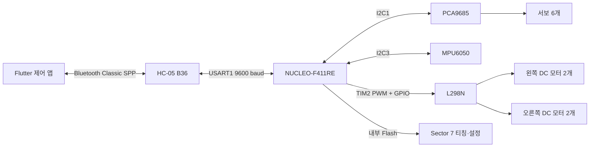
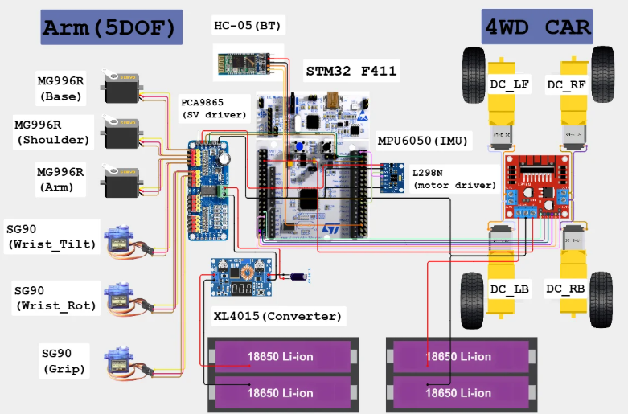
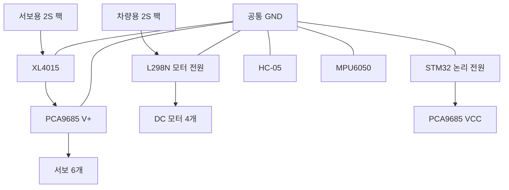

# 모바일 물품 회수 로봇 프로젝트 종합 정리

> STM32F411 기반 4WD 이동 플랫폼과 5자유도 로봇팔을 Flutter 앱으로 제어하는
> 모바일 물품 회수 로봇입니다. 이 문서는 발표와 최종 검수를 위한 단일 요약본이며,
> 세부 구현의 최종 기준은 소스 코드와 `docs/` 원본 문서입니다.

## 1. 프로젝트 한눈에 보기

| 항목 | 내용 |
|---|---|
| 프로젝트 목표 | 스마트폰으로 이동·물체 접근·잡기·운반·놓기 수행 |
| 메인 제어기 | NUCLEO-F411RE / STM32F411RETx |
| 이동부 | L298N과 DC 기어모터 4개를 이용한 좌우 차동 구동 |
| 로봇팔 | 회전 5축과 Gripper, 서보 총 6개 |
| 서보 제어 | PCA9685, 50 Hz PWM, 6채널 사용 |
| 무선 통신 | HC-05 Bluetooth Classic SPP, UART 9600 baud |
| 자세 센서 | MPU6050 가속도·자이로 |
| 제어 앱 | Flutter Android 앱 |
| 펌웨어 | STM32 HAL, FreeRTOS CMSIS-RTOS2, C11 |
| 빌드 | STM32CubeMX 네이티브 CMake, GCC Arm Embedded |
| 데이터 저장 | STM32 내부 Flash Sector 7 |
| 시뮬레이터 | Python과 PyBullet, 보조 검증용 |

### 핵심 구현 기능

- Flutter 앱에서 차량, 로봇팔, 티칭을 한 번에 제어.
- 고정 16바이트 Bluetooth 바이너리 패킷과 ACK.
- PCA9685 기반 6채널 서보 제어와 20 ms S-curve 이동.
- L298N 기반 4WD 차동 조향과 500 ms 통신 타임아웃.
- MPU6050 상대 Yaw 기반 직진·후진 방향 안정화 PID.
- 이름을 포함한 12개 티칭 시퀀스, 시퀀스당 최대 30개 웨이포인트.
- PID 계수와 서보 3점 보정값의 Flash 저장.
- E-STOP, 차량·로봇팔 인터록, Flash 작업 보호.

### 프로젝트 범위 밖 기능

- 초음파 거리 센서.
- 휠 엔코더와 휠 속도 폐루프 제어.
- 자력계 기반 절대 Yaw 보정.
- 역기구학과 XYZ 좌표 제어.
- 완성된 차량 동역학 시뮬레이션.
- 앱 스토어 배포와 상용 제품 수준 전원 보호 회로.

## 2. 개발 배경과 목표

일반적인 RC카는 이동만 가능하고, 고정형 로봇팔은 작업 영역이 제한됩니다.
이 프로젝트는 두 장치를 결합해 사용자가 스마트폰으로 목표물에 접근하고,
로봇팔로 물체를 잡은 뒤 다른 위치로 운반하는 과정을 구현합니다.

설계 목표는 다음과 같습니다.

1. 한 앱에서 차량과 로봇팔을 쉽게 조작.
2. 사용자가 직접 자세를 기록하는 티칭 기능 제공.
3. 실물마다 다른 서보 끝점을 앱에서 보정.
4. 통신 오류나 동작 충돌 시 차량과 로봇팔을 안전하게 정지.
5. 센서가 없어도 기본 제어가 가능하고, 센서가 있으면 직진 안정성 향상.

## 3. 전체 시스템 구성



### 최종 다이어그램


### 최종 배선도



### 제어 흐름

```text
사용자 입력
  → Flutter UI
  → 16바이트 명령 패킷
  → HC-05
  → USART1 circular DMA
  → BluetoothTask 검증
  → ArmQueue 또는 DriveQueue
  → 로봇팔·차량·Flash 처리
  → 16바이트 ACK/상태 패킷
  → 앱 상태 갱신
```

앱은 모든 명령의 기준입니다. 펌웨어는 잘못된 Header, Tail, Mode, Checksum,
범위 또는 예약 바이트를 가진 패킷을 폐기합니다. 무효 프레임 뒤에는 다음
`0xAA` Header를 찾아 스트림을 다시 동기화합니다.

## 4. 하드웨어 구성

### 부품 목록

| 구분 | 부품 | 수량 | 역할 |
|---|---|---:|---|
| 메인 제어 | NUCLEO-F411RE | 1 | 통신, 제어, 저장, RTOS 실행 |
| Bluetooth | HC-05 B36 | 1 | Android와 Classic SPP 통신 |
| IMU | MPU6050 모듈 | 1 | 가속도·자이로와 상대 Yaw |
| 서보 드라이버 | PCA9685 | 1 | 50 Hz 서보 PWM 생성 |
| 고토크 서보 | MG996R | 3 | Base, Shoulder, Elbow |
| 소형 서보 | SG90 | 3 | Wrist Tilt, Wrist Rotate, Gripper |
| 모터 드라이버 | L298N | 1 | 좌우 DC 모터 그룹 구동 |
| 이동부 | DC 기어모터·바퀴 | 각 4 | 4WD 이동 |
| 배터리 | 18650 | 4 | 독립된 2S 팩 2개 |
| 배터리 홀더 | 2S | 2 | 서보용·차량용 전원 분리 |
| 강압 모듈 | XL4015 | 1 | 서보 전압 강하 |
| 안정화 | 1000 µF 전해 커패시터 | 1 | PCA9685 V+ 전압 변동 완화 |
| 기구부 | 3D 출력물·체결 부품 | 1세트 | 로봇팔 링크와 고정부 |

### 로봇팔 자유도와 채널

로봇팔은 다섯 개의 자세 축과 Gripper로 구성됩니다. 따라서 기구 자유도는
5DOF이며, 실제 제어 서보는 6개입니다.

| PCA9685 채널 | 관절 | 기능 | 서보 |
|---:|---|---|---|
| 0 | Base | 좌우 회전 | MG996R |
| 1 | Shoulder | 어깨 상하 | MG996R |
| 2 | Elbow | 팔꿈치 상하 | MG996R |
| 3 | Wrist Tilt | 손목 상하 | SG90 |
| 4 | Wrist Rotate | 손목 회전 | SG90 |
| 5 | Gripper | 열기·닫기 | SG90 |

### 전원 구조



- PCA9685 `VCC`는 STM32 논리 전원, `V+`는 XL4015 외부 서보 전원입니다.
- 두 배터리 팩의 양극은 서로 연결하지 않습니다.
- STM32, PCA9685, L298N, HC-05, MPU6050과 두 전원의 GND는 공통입니다.
- 서보와 모터 고전류 귀환은 STM32 보드나 신호용 점퍼선을 지나지 않습니다.
- PCA9685 `V+`–GND에 1000 µF 커패시터를 연결합니다.
- L298N ENA/ENB 점퍼는 제거하고 STM32의 20 kHz PWM을 입력합니다.
- STM32 VIN용 DC-DC는 실물에 적용되어 있습니다.

### 현재 전원 구성의 한계

- BMS 미적용.
- 퓨즈 미적용.
- 구동 전원을 직접 끊는 물리 비상정지 미적용.
- 앱 E-STOP은 논리적 출력 차단이며 물리 전원 차단이 아님.

XL4015 출력과 STM32 VIN용 DC-DC는 실물에 배선·적용되어 있습니다. 구체적인
출력 전압 측정값은 저장소 문서에 기록되지 않아 이 문서에서 임의로 지정하지
않습니다.

## 5. STM32 핀 배치

### I2C1

| 기능 | STM32 핀 | 연결 |
|---|---|---|
| I2C1 SCL | PB8 | PCA9685 SCL |
| I2C1 SDA | PB9 | PCA9685 SDA |

### I2C3

| 기능 | STM32 핀 | 연결 |
|---|---|---|
| I2C3 SCL | PA8 | MPU6050 SCL |
| I2C3 SDA | PC9 | MPU6050 SDA |
| MPU6050 AD0 | GND | 주소 `0x68` 선택 |
| MPU6050 INT | 미연결 | 20 ms polling 사용 |

- PCA9685 기본 주소: `0x40`.
- MPU6050 VCC와 I2C 배선은 실제 모듈 기준으로 적용되어 있습니다.
- 구체적인 MPU6050 공급전압과 모듈 pull-up 값은 저장소 문서에 미기록 상태입니다.

### Bluetooth USART1

| 기능 | STM32 | HC-05 |
|---|---|---|
| USART1 TX | PA9 | RXD |
| USART1 RX | PA10 | TXD |

- 속도: 9600 baud.
- 프레임: 8 data bits, No parity, 1 stop bit.
- RX: DMA2 Stream2 circular mode, 128바이트 버퍼.

### L298N

| 기능 | STM32 핀 | 역할 |
|---|---|---|
| ENA | PA0 / TIM2 CH1 | 왼쪽 모터 그룹 PWM |
| IN1 | PC0 | 왼쪽 방향 |
| IN2 | PC1 | 왼쪽 방향 |
| ENB | PA1 / TIM2 CH2 | 오른쪽 모터 그룹 PWM |
| IN3 | PC2 | 오른쪽 방향 |
| IN4 | PC3 | 오른쪽 방향 |

- TIM2: Prescaler 4, Auto-reload 999, 20 kHz.
- 초기 PWM과 방향 GPIO는 모두 0.
- 좌우 전진 GPIO 극성은 실제 L298N·모터 배선에 맞춰 적용되어 있습니다.

### 디버깅과 예비 핀

| 기능 | 핀 |
|---|---|
| SWD | PA13, PA14 |
| 예비 | PA2, PA3 |

최종 필드 펌웨어는 USART2와 PC Teleplot 출력을 사용하지 않습니다. PID·IMU 상태는
Bluetooth 상태 패킷으로 앱에 표시합니다.

## 6. 펌웨어 구성

### 기술 스택

- STM32CubeMX 생성 프로젝트.
- STM32 HAL Driver.
- FreeRTOS CMSIS-RTOS2.
- C11 애플리케이션 코드.
- CMake 3.22 이상과 Ninja.
- GCC Arm Embedded toolchain.

### 클록과 주변장치

| 항목 | 설정 |
|---|---|
| HSE | NUCLEO 8 MHz bypass clock source |
| SYSCLK / HCLK | 100 MHz / 100 MHz |
| PCLK1 / PCLK2 | 50 MHz / 100 MHz |
| I2C1 / I2C3 | 각각 100 kHz |
| TIM2 | 20 kHz 모터 PWM |
| PCA9685 | 50 Hz 서보 PWM |
| USART1 | 9600 baud, 8-N-1 |

### 애플리케이션 라이브러리

| 모듈 | 역할 |
|---|---|
| `bluetooth` | DMA 수신, 16바이트 파싱, 검증, ACK·상태 전송 |
| `servo_driver` | PCA9685 초기화와 채널 PWM 출력 |
| `robot_arm` | 6채널 자세, 보정, S-curve, 티칭 재생 |
| `drive_4wd` | L298N PWM·방향, 타임아웃, 인터록, Yaw PID |
| `teaching_storage` | 시퀀스·설정의 Sector 7 저장과 검증 |
| `imu` | MPU6050 초기화, 보정, 필터, 상대 Yaw |

의존 관계는 다음과 같습니다.

```text
BluetoothTask ── bluetooth ── USART1 DMA
ArmTask ─────── robot_arm ─── servo_driver ── I2C1/PCA9685
ArmTask ─────── teaching_storage ───────────── 내부 Flash
DriveTask ───── drive_4wd ─────────────────── TIM2/GPIO/L298N
ImuTask ─────── imu ───────────────────────── I2C3/MPU6050
StatusTask ──── bluetooth ─────────────────── PID·IMU 상태 송신
```

### FreeRTOS 구조

| 태스크 | 우선순위 | 스택 | 역할 |
|---|---|---:|---|
| `bluetoothTask` | AboveNormal | 384 words | DMA 데이터 파싱과 큐 전달 |
| `armTask` | Normal | 384 words | 로봇팔, 티칭, 설정, Flash |
| `driveTask` | High | 256 words | 차량 제어와 타임아웃 검사 |
| `imuTask` | BelowNormal | 512 words | MPU6050 보정과 20 ms 측정 |
| `statusTask` | Low | 256 words | PID·IMU 상태 전송 |

| RTOS 객체 | 설정 | 용도 |
|---|---:|---|
| `armQueue` | 길이 8 | 로봇팔·티칭·설정 명령 |
| `driveQueue` | 길이 4 | 차량 명령 |
| `i2cMutex` | Mutex | PCA9685 I2C1 직렬화 |
| `imuI2cMutex` | Mutex | MPU6050 I2C3 직렬화 |
| `flashMutex` | Mutex | Sector 7 삭제·기록 직렬화 |

ISR에서는 패킷 파싱, 장치 제어, Mutex 획득과 Flash 작업을 하지 않습니다.
UART 오류 콜백은 플래그만 기록하고 BluetoothTask가 DMA를 재시작합니다.

### 부팅 순서

1. 차량 GPIO와 PWM을 0으로 초기화.
2. E-STOP 잠금과 서보 출력 OFF 유지.
3. RTOS Queue, Mutex와 Task 생성.
4. Sector 7의 티칭·PID·서보 보정값 읽기.
5. PCA9685 초기화. 실패하면 로봇팔만 비활성화하고 1초마다 재시도.
6. MPU6050 확인. 연결되면 차량을 정지하고 3초 영점 보정.
7. 앱 연결과 사용자의 STOP 해제·로봇팔 활성화 대기.

저장된 자세나 티칭 시퀀스를 부팅 직후 자동 재생하지 않습니다.

## 7. 로봇팔 제어

### 앱 표시와 내부 값

| 대상 | 앱 표시 | 패킷·Flash |
|---|---|---|
| Base~Wrist Rotate | `-90~+90°` | `0~180` |
| Gripper | 열림 `0%`~닫힘 `100%` | `0~180` |
| 속도 | `50~100%` | `50~100` |

일반 서보에는 위치 피드백이 없습니다. 앱과 펌웨어가 표시하는 위치는 실제 측정값이
아니라 마지막으로 요청한 위치입니다.

### 원점과 이동 자세

- 원점: 다섯 관절 `0°`, Gripper 완전 열림 `0%`.
- 원점 패킷: `[90,90,90,90,90,0]`.
- 이동 자세: 티칭 시퀀스 9.
- 이동 자세 실행 시 현재 Gripper 위치 유지.
- Gripper를 여는 동작은 사용자가 `원점으로 이동`을 명시적으로 요청한 경우만 수행.

### 이동 방식

- PCA9685 갱신 주기에 맞춘 20 ms 제어 주기.
- 5차 S-curve를 이용해 느리게 출발하고, 중간에 가속한 뒤, 목표에서 감속.
- 앱에서 `50~100%` 속도 선택. `100%`의 각속도 상한은 약 `62.5°/s`.
- 이동 시간은 20 ms부터 25%씩 늘려 6개 관절의 속도·가속도·저크 제한을
  모두 만족하는 가장 짧은 후보로 자동 결정.
- 이동 중 목표나 속도가 변해도 현재 위치·속도·가속도를 이어서 재계획.
- 목표 도착 뒤 Transaction ID를 포함한 ACK 전송.
- 시퀀스 완료 ACK 뒤 마지막 명령 자세를 앱 수동 제어 화면에 반영.
- Flash 시퀀스의 마지막 자세 조회부터 재생 완료까지 중복 요청을 잠그며, 조회
  실패 시 실제 재생을 시작하지 않음.
- 첫 출력 활성화는 실제 시작 위치를 모르므로 설정 속도를 보장할 수 없음.

### 방향 설정

| 관절 | 출력 방향 |
|---|---|
| Base | 반전 |
| Shoulder | 반전 |
| Elbow | 기본 |
| Wrist Tilt | 반전 |
| Wrist Rotate | 반전 |
| Gripper | 반전 |

### 서보 안전 초기값

Sector 7에 유효한 보정값이 없을 때만 사용합니다. 실측 끝점이 아닙니다.

| 채널 | 관절 | -90°/열림 | 중앙 | +90°/닫힘 |
|---:|---|---:|---:|---:|
| 0 | Base | 2300 µs | 1500 µs | 700 µs |
| 1 | Shoulder | 2300 µs | 1500 µs | 700 µs |
| 2 | Elbow | 700 µs | 1500 µs | 2300 µs |
| 3 | Wrist Tilt | 2300 µs | 1500 µs | 700 µs |
| 4 | Wrist Rotate | 2300 µs | 1500 µs | 700 µs |
| 5 | Gripper | 1800 µs | 1500 µs | 1200 µs |

### 실측 보정값

| 채널 | 관절 | -90° | 0° | +90° | 상태 |
|---:|---|---:|---:|---:|---|
| 0 | Base | 2500 | 1500 | 500 | 측정 완료 |
| 1 | Shoulder | 2322 | 1466 | 633 | 측정 완료 |
| 2 | Elbow | 633 | 1500 | 2388 | 측정 완료 |
| 3 | Wrist Tilt | 2500 | 1500 | 500 | 임시값 |
| 4 | Wrist Rotate | 2533 | 1500 | 500 | 측정 완료 |

단위는 µs입니다. Wrist Tilt 끝점은 실기 확인이 필요합니다.

| Gripper 상태 | 앱 | 패킷 | 실측 펄스 |
|---|---:|---:|---:|
| 최대 열림 | 0% | 0 | 1840 µs |
| 중간 | 50% | 90 | 1490 µs |
| 최대 닫힘 | 100% | 180 | 1140 µs |

### 앱 원점 보정 절차

1. 원점 보정 화면 진입.
2. 전체 원점 이동과 도착 ACK 확인.
3. Base부터 Gripper까지 관절 선택.
4. 일반 관절 `-90/0/+90°`, Gripper 열림·닫힘 펄스 조정.
5. 확인 시퀀스로 끝점과 중앙 확인.
6. 저장 버튼으로 Sector 7에 기록.

| 대상 | 앱 조정 범위 |
|---|---:|
| 일반 관절 | `350~2650 µs` |
| Gripper | `1000~2000 µs` |

Gripper 중앙값은 열림과 닫힘의 평균으로 자동 계산합니다. 미리보기 중 선택한 관절만
움직이고 다른 관절은 원점을 유지합니다. 최신 목표 도착 ACK 전에는 관절 전환이나
저장을 허용하지 않습니다.

## 8. 차량 제어

### 구동 방식

- 왼쪽 모터 2개를 한 그룹, 오른쪽 모터 2개를 한 그룹으로 제어.
- 좌우 PWM 차이로 전진, 후진, 회전과 곡선 주행 구현.
- 앱 조이스틱 PWM `0~220`을 전송하고 펌웨어가 `0~255` 범위에서 PID 보정.
- 앱이 조이스틱 입력 중 약 100 ms마다 최신 명령 전송.
- PWM이 0이면 해당 모터 그룹 정지.
- 회전 방향 변경 시 한 패킷 동안 중립 정지 후 역방향 적용.
- PID 직진 판정 X축 범위는 앱에서 `0.00~1.00`으로 조정하며 기본값은 `0.10`.
- PID 직진 중에는 판정 범위를 `+0.04` 넓혀 경계에서 반복 전환되지 않게 함.

### 차량 안전 조건

- 부팅 직후 E-STOP 잠금.
- 마지막 유효 차량 명령 후 500 ms가 지나면 자동 정지.
- 앱이 백그라운드로 이동하면 즉시 정지 명령 전송.
- 로봇팔 이동·티칭 재생·원점 보정·Flash 작업·IMU 보정 중 차량 정지.
- 인터록 해제 전에 받은 오래된 주행 패킷 폐기.
- Assert, Stack overflow와 동적 메모리 실패에서 모터 출력 정지.
- 로봇팔 ACK가 10초 동안 없으면 앱이 STOP 요청.

## 9. MPU6050와 상대 Yaw PID

### 센서 처리

1. `WHO_AM_I=0x68` 확인.
2. 가속도 ±2g, 자이로 ±250 dps 설정.
3. 정지 상태에서 3초 자이로 영점 보정.
4. 20 ms마다 센서 읽기.
5. 2 Hz 1차 저역통과 필터 적용.
6. X/Y축 0.30 dps, Z축 0.15 dps deadband 적용.
7. Z축 각속도 적분으로 `-180~+180°` 상대 Yaw 생성.

센서가 연결되지 않아도 수동 차량, 로봇팔과 티칭은 사용할 수 있습니다. 센서가
연속 세 번 실패하면 PID를 끄고 차량을 정지한 뒤 1초마다 재연결합니다.

### 방향 안정화 PID

- 직진·후진 시작 시 현재 Yaw를 목표각으로 저장.
- 좌우 PWM에 PID 보정값을 반대 방향으로 적용.
- 제자리 회전과 곡선 회전에는 적용하지 않음.
- 장착 방향 보정 부호 `-1`, 후진 시 다시 반전.
- 적분항 제한: `±50`.
- 최종 PWM 보정 제한: `±80`.
- 초기 계수: `Kp=2.00`, `Ki=1.40`, `Kd=0.00`.
- 앱 범위: Kp `0.00~2.55`, Ki/Kd `0~100`.
- PID는 부팅 시 자동 활성화하지 않음.
- E-STOP, 정지, 회전, 방향 전환, 통신 타임아웃과 인터록에서 상태 초기화.

MPU6050에는 자력계가 없습니다. 따라서 장시간 누적 오차가 생길 수 있으며 절대
방향을 유지하지 않습니다. 각 직진·후진 구간에서 시작 방향을 유지하는 용도입니다.

## 10. Bluetooth 통신 규격

### 공통 16바이트 프레임

```text
[Header, Mode, Data0, Data1, ... Data11, Checksum, Tail]
```

| Byte | 내용 |
|---:|---|
| 0 | Header `0xAA` |
| 1 | Mode |
| 2~13 | Data0~Data11 |
| 14 | Byte 1~13 합의 하위 8비트 |
| 15 | Tail `0x55` |

| Mode | 기능 |
|---:|---|
| `0x00` | 차량 제어, E-STOP, PID·IMU 상태 |
| `0x01` | 로봇팔 제어와 출력 상태 |
| `0x02` | 티칭 업로드·조회·재생·초기화 |
| `0x03` | PID·서보 보정 설정 |

ASCII 문자열은 사용하지 않습니다. 명령과 ACK가 같은 고정 길이를 사용하므로 DMA
스트림에서 프레임 경계를 찾고 검증하기 쉽습니다.

### Mode 0: 차량

```text
[AA,00,L_DIR,L_PWM,R_DIR,R_PWM,Control,Engine,PidStraight,RefreshYaw,
 00,00,00,00,Checksum,55]
```

- 방향: `0` 전진, `1` 후진.
- Control: `0` 일반, `1` E-STOP, `2` E-STOP 해제.
- Engine: `0` 정지, `1` 주행.
- PID는 좌우 방향이 같고 PWM이 하나 이상 0보다 클 때만 요청 가능.
- E-STOP과 해제 패킷은 방향·PWM·Engine·PID 필드가 모두 0이어야 함.
- 약 500 ms 간격으로 PID와 IMU 상태를 각각 갱신.

### Mode 1: 로봇팔

```text
[AA,01,Base,Shoulder,Elbow,WristTilt,WristRotate,Gripper,
 Control,TransactionId,Speed,00,00,00,Checksum,55]
```

| Control | 기능 |
|---:|---|
| 0 | 지정 자세로 이동 |
| 1 | 원점으로 이동하며 출력 활성화 |
| 2 | PCA9685 출력 차단 |
| 3 | 시퀀스 9를 현재 Gripper 유지 상태로 실행 |

Transaction ID는 `1~255`, 속도는 `50~100%`입니다. 앱은 요청과 같은 Transaction
ID의 ACK만 완료로 인정합니다.

### Mode 2: 티칭

| Command | 기능 |
|---:|---|
| 2 | Flash 저장 시퀀스 재생 |
| 3 | 선택 시퀀스 초기화 |
| 4 | 이름·웨이포인트 업로드와 COMMIT |
| 5 | 저장 이름 조회 |
| 6 | 저장 웨이포인트 조회 |
| 7 | 현재 편집본 임시 재생 |

업로드는 START → NAME → FIRST → SECOND → COMMIT 순서입니다. 각 웨이포인트는
16바이트 패킷에 맞추기 위해 앞의 세 관절과 뒤의 세 관절로 나눕니다. 모든 이름과
웨이포인트 조각이 도착해야 COMMIT을 허용합니다.

### Mode 3: 설정

| Command | 기능 |
|---:|---|
| 1 | 53바이트 설정 조회 요청 |
| 2 | 설정 조각 업로드 |
| 3 | CRC 확인과 Flash 저장 |
| 4 | 설정 조회 응답 조각 |
| 5 | 서보 펄스 미리보기 |
| 6 | 미리보기 종료 |
| 7 | PID 적용·해제 |

설정은 53바이트를 6개 업로드 조각 또는 7개 조회 조각으로 전달합니다. 저장 전
CRC-16/CCITT-FALSE로 전체 데이터를 검증합니다.

## 11. 티칭 시스템

### 저장 구조

- 총 12개 시퀀스.
- 시퀀스당 최대 30개 웨이포인트.
- 웨이포인트 하나에 Base부터 Gripper까지 6개 목표값 저장.
- 시퀀스 이름은 UTF-8 1~21바이트.

| 시퀀스 | 이름 | 이름 변경 | 용도 |
|---:|---|---|---|
| 1~8 | 사용자 지정 | 가능 | 사용자 동작 |
| 9 | 이동 자세 | 불가 | 차량 주행 준비 |
| 10 | 잡기 위치 | 불가 | 물체 앞 접근 자세 |
| 11 | 잡기 | 불가 | Gripper로 물체 잡기 |
| 12 | 놓기 | 불가 | 물체 놓기 |

고정 시퀀스는 앱에서 잠금 아이콘과 별도 색으로 구분합니다. 펌웨어도 9~12번의
이름 변경을 거부합니다.

### 편집과 재생 원칙

- 로봇팔 화면에서 현재 자세를 웨이포인트로 추가·삭제.
- 티칭 화면에서 각도 직접 입력, 순서 확인, 이름 변경.
- 현재 편집본 재생은 Flash에 쓰지 않고 펌웨어 임시 RAM에서 즉시 실행.
- 다른 시퀀스를 선택하면 미저장 변경을 버리고 Flash 원본을 다시 조회.
- 차량 화면의 시퀀스 9~12 동작은 Flash 저장본 사용.
- 업로드·초기화 중 탭 이동과 데이터 수정 잠금.
- 성공 ACK를 받은 뒤에만 앱 목록과 저장 상태 갱신.
- 부팅 직후 저장 시퀀스를 자동 실행하지 않음.

## 12. Flash 저장

| 항목 | 값 |
|---|---|
| MCU 영역 | 내부 Flash Sector 7 |
| 시작 주소 | `0x08060000` |
| 크기 | 128 KiB |
| 현재 저장 이미지 | 2,516바이트 |
| 애플리케이션 FLASH 제한 | 384 KiB |
| 저장 형식 | 버전 8 |
| 무결성 | 이미지 CRC, 설정 CRC, 기록 후 재읽기 검증 |

애플리케이션 링커 영역을 384 KiB로 제한해 Sector 7과 코드가 겹치지 않게 합니다.
기록할 때 Sector 7 전체를 삭제한 뒤 현재 이미지만 앞부분에 씁니다.

### 저장 데이터

- 12개 시퀀스 이름.
- 시퀀스별 웨이포인트 개수와 각도.
- PID Kp, Ki, Kd.
- 6개 서보의 3점 펄스 보정값.
- 이전 버전 호환용 이동 자세 5바이트.
- Magic, 형식 버전과 CRC.

설정 53바이트의 구성은 다음과 같습니다.

| Byte | 데이터 |
|---:|---|
| 0~3 | Kp ×1000, signed int32 LE |
| 4~7 | Ki ×1000, signed int32 LE |
| 8~11 | Kd ×1000, signed int32 LE |
| 12~47 | 서보 6개 × 3점 × uint16 LE |
| 48~52 | 호환용 이동 자세 5바이트 |

- 모든 조각을 RAM에 모은 뒤 COMMIT에서 한 번 저장.
- 기록 뒤 Flash 내용을 다시 읽어 원본과 비교.
- 형식 버전 2~7은 가능한 티칭·설정을 보존해 변환.
- 버전 1은 Gripper 의미가 달라 거부.
- 매 관절 이동마다 Flash를 쓰지 않아 불필요한 마모 방지.
- 저장·초기화 완료 ACK 전에는 전원을 끄면 안 됨.

현재 저장 이미지는 Sector 7 단일 복사본입니다. 삭제·기록 중 전원이 꺼지면 기존
이미지도 무효화될 수 있습니다. 프로젝트 범위에서는 CRC와 재읽기 검증을 사용하며,
상용 수준 전원 장애 복구가 필요하면 A/B 이중 저장이 추가로 필요합니다.

## 13. Flutter 앱

### 기술 구성

| 항목 | 내용 |
|---|---|
| Framework | Flutter |
| Language | Dart, SDK `^3.12.2` |
| 상태 관리 | `provider 6.1.2` |
| Bluetooth | `flutter_classic_bluetooth 0.1.8` |
| 조이스틱 | `flutter_joystick 0.2.2` |
| 대상 | Android, 프로젝트용 직접 설치 |

### 화면 구성

| 화면 | 주요 기능 |
|---|---|
| 차량 | 조이스틱, 전용 시퀀스, PID·직진 판정 범위 설정과 상태 |
| 로봇팔 | 6채널 수동 제어, 속도 설정, 원점 이동·보정 |
| 티칭 | 시퀀스 선택, 이름·웨이포인트 편집, 재생·저장·초기화 |

- 세로 화면은 하단 NavigationBar 사용.
- 가로 화면은 왼쪽 NavigationRail 사용.
- 연결과 STOP은 모든 화면에서 접근 가능.
- 앱을 처음 사용하는 사용자를 위한 단계·상태·실패 메시지 표시.
- 조작 중인 버튼과 완료 ACK를 구분해 중복 요청 방지.
- 업로드나 초기화 중 다른 화면으로 이동하지 못하게 잠금.

### 입력 안전성

- 슬라이더 트랙 탭으로 값이 즉시 점프하지 않음.
- 손잡이 드래그는 300 ms 이상 눌러야 시작.
- `-`/`+` 짧은 입력은 한 단계, 길게 누르면 연속 증가·감소.
- 서보 보정 저장 전 최신 STM32 설정을 다시 읽어 다른 설정 덮어쓰기 방지.
- PID 저장은 차량 화면, 서보 보정은 로봇팔 화면에서만 수행.
- 조이스틱 직진 판정 범위는 앱 실행 중 유지하며 STM32 Flash에는 저장하지 않음.
- 시퀀스 완료 ACK 뒤 마지막 웨이포인트를 수동 제어 화면에 동기화.
- Flash 작업 중 앱 종료·전원 차단 경고 표시.

### 기능 확인 모드

화면 제목을 길게 눌러 Bluetooth 없이 UI와 앱 내부 로직을 시험할 수 있습니다.
기능 확인 모드는 실제 패킷이나 Flash를 변경하지 않으며 실제 연결 중에는 시작할
수 없습니다.

## 14. 시뮬레이터

PyBullet 시뮬레이터는 앱·펌웨어와 같은 관절 순서, 방향과 Mode 1 패킷을 PC에서
확인하는 보조 도구입니다. STM32나 앱과 직접 통신하지 않습니다.

| 항목 | 내용 |
|---|---|
| 언어 | Python |
| 물리 엔진 | PyBullet |
| 모델 | URDF와 STL 메시 |
| 관절 | Base, Shoulder, Elbow, Wrist Tilt, Wrist Rotate, Gripper |
| 검사 | URDF, 질량, 관성, 관절, 패킷과 PID 계산 |

### 활용과 확장

- 링크 질량은 실측값, 링크 길이는 캡처 치수를 5 mm 단위로 정리한 값.
- 무게중심, 관성텐서와 충돌 형상은 관절·패킷 검증용 근사값.
- 기본 중력 0에서 관절 방향, Mode 1 패킷과 PID 계산을 확인.
- 실측 동역학 값을 추가하면 토크·충돌·차량 주행 검증까지 확장 가능.

## 15. 안전 설계

### 소프트웨어 안전

- 부팅 직후 E-STOP 잠금.
- 차량 명령 500 ms 타임아웃.
- 앱 백그라운드 전환 시 즉시 정지.
- E-STOP 한 명령으로 차량과 PCA9685 출력 차단.
- 로봇팔 이동·티칭·설정 중 차량 인터록.
- Flash 작업 중 차량 정지.
- IMU 보정·오류 중 PID 정지.
- 모터 방향 전환 전 중립 구간.
- 패킷 전체 검증과 예약 바이트 검사.
- Transaction ID와 Request ID로 오래된 ACK 무시.
- RTOS 객체 생성 실패, Assert와 Stack overflow에서 안전 정지.

### 하드웨어 운용 안전

1. 전원 연결 전 극성·공통 GND 확인.
2. PCA9685 VCC와 V+ 분리 확인.
3. 서보 전원과 차량 전원 양극 분리 확인.
4. 로봇팔 주변 사람과 장애물 제거.
5. 낮은 부하에서 서보 한 축씩 보정.
6. 기구 걸림, 떨림, 소음 또는 과열 시 즉시 STOP 후 구동 전원 차단.
7. Flash 저장 완료 ACK 전 전원 차단 금지.

현재 BMS, 퓨즈와 물리 비상정지가 없으므로 실험 장비 운용 수준의 주의가
필요합니다.

## 16. 저장소 구조

```text
mobile-retrieval-robot/
├─ app/                         Flutter Android 앱
│  ├─ lib/main.dart             화면과 앱 상태 관리
│  ├─ lib/protocol/             16바이트 패킷 코덱
│  └─ test/                     앱·프로토콜 테스트
├─ firmware/
│  └─ mobile_retrieval_robot/
│     ├─ App/Inc, App/Src       애플리케이션 라이브러리
│     ├─ Core                   CubeMX 생성 코드와 RTOS 연결
│     ├─ Drivers                STM32 HAL
│     ├─ Middlewares            FreeRTOS
│     ├─ cmake                  CubeMX CMake 지원
│     ├─ CMakeLists.txt
│     └─ mobile_retrieval_robot.ioc
├─ simulator/                   PyBullet 보조 시뮬레이터
├─ docs/
│  ├─ hardware/                BOM, 핀맵, 서보, IMU
│  ├─ protocol/                Bluetooth 규격
│  └─ collaboration/           협업 문서
├─ AGENTS.md                    전체 설계·작업 기준
├─ README.md                    저장소 소개
└─ PROJECT_SUMMARY.md           발표용 종합 문서
```

## 17. 빌드와 실행

### Flutter 앱

```powershell
cd app
flutter pub get
flutter run
```

스마트폰 Android 설정에서 HC-05를 먼저 페어링합니다. 앱 실행 후 Bluetooth 권한을
허용하고 페어링된 HC-05를 선택합니다.

### STM32 펌웨어

```powershell
cd firmware/mobile_retrieval_robot
cmake --preset Debug
cmake --build --preset Debug
```

VS Code STM32 확장에서는 `cube-cmake`와 설치된 GCC Arm toolchain을 사용합니다.
생성된 ELF를 ST-LINK/SWD로 NUCLEO-F411RE에 기록합니다.

### 시뮬레이터

```powershell
cd simulator
python -m venv .venv
.\.venv\Scripts\Activate.ps1
python -m pip install -r requirements.txt
python main.py
```

## 18. 사용 순서

1. 모든 신호선, 전원 극성, 공통 GND 확인.
2. 서보용·차량용 외부 전원 인가.
3. STM32 부팅과 MPU6050 3초 보정 대기.
4. Android 설정에서 HC-05 페어링.
5. 앱에서 HC-05 연결.
6. 초기 STOP 잠금 해제.
7. 로봇팔 화면에서 `원점으로 이동` 선택.
8. 실제 원점 도착 확인.
9. 차량 화면 진입 시 이동 자세 시퀀스 9 완료 대기.
10. 차량, 로봇팔 또는 티칭 기능 사용.

## 19. 검증 결과

2026-08-03 기준 전체 검사 결과입니다.

| 검사 | 결과 |
|---|---|
| Flutter 정적 분석 | `flutter analyze` 경고 0개 |
| Flutter 테스트 | 31개 통과 |
| Android Debug APK | 빌드 성공 |
| STM32 Debug CMake | 빌드 성공 |
| 펌웨어 Flash 사용 | 72,272 B / 384 KiB, 약 18.38% |
| 펌웨어 RAM 사용 | 29,032 B / 128 KiB, 약 22.15% |
| 시뮬레이터 단위 테스트 | 13개 통과 |
| PyBullet URDF DIRECT 로딩 | 성공 |
| Markdown 링크 검사 | 통과 |

`flutter_classic_bluetooth 0.1.8`은 현재 빌드되지만 Flutter의 미래 Kotlin Gradle
처리 방식과 관련한 경고가 있습니다. 현재 프로젝트 실행에는 영향이 없으며 Flutter
메이저 업데이트 전에 대체 플러그인의 실기기 검증이 필요합니다.

## 20. 현재 구현과 발전 방향

### 구현 완료

- 앱·펌웨어 고정 16바이트 프로토콜 일치.
- 4WD 수동 주행, 정지와 통신 타임아웃.
- 6채널 로봇팔 수동 제어와 S-curve.
- 원점 보정과 Flash 저장.
- 이름 포함 티칭 시퀀스 편집·저장·재생·초기화.
- 이동 자세·잡기 위치·잡기·놓기 전용 시퀀스.
- MPU6050 측정과 상대 Yaw PID.
- 주요 차량·로봇팔 상호 인터록.
- Flutter UI, 오류 안내와 기능 확인 모드.

### 실물 적용 완료

- XL4015 서보 전원과 STM32 VIN용 DC-DC 배선.
- MPU6050 VCC, I2C 배선과 실제 장착 방향.
- MPU6050 장착 방향을 반영한 펌웨어 PID 보정 부호 `-1`.
- L298N 좌우 전진 GPIO 극성과 모터 배선.

구체적인 전원 출력 측정값은 저장소 문서에 아직 숫자로 기록되지 않았습니다.
확인되지 않은 숫자를 이 문서에서 추정하지 않습니다.

### 완성도 향상

- Wrist Tilt 실제 안전 끝점.
- 실제 차체에서 PID 계수 조정.
- 로봇팔을 펼친 상태에서 허용할 차량 속도.

### 발전 가능성

- 위치 피드백 서보를 적용한 관절 폐루프 제어.
- 절대 방향 센서를 결합한 장시간 Yaw 보정.
- 휠 엔코더를 이용한 속도·거리 제어.
- 이중 저장이나 저널링을 이용한 Flash 복구 강화.
- 물리 비상정지와 전원 보호 회로 추가.
- 실측 질량·관성을 반영한 차량·로봇팔 동역학 시뮬레이션.

## 21. 발표 시연 권장 순서

1. 전체 하드웨어와 전원 분리 구조 설명.
2. 앱에서 HC-05 연결과 초기 STOP 잠금 확인.
3. 원점 이동과 부드러운 S-curve 시연.
4. 로봇팔 수동 제어와 Gripper 열기·닫기 시연.
5. 티칭에서 사용자 시퀀스 이름과 웨이포인트 생성.
6. Flash 저장 후 현재 편집본과 저장본 재생 차이 설명.
7. 이동 자세 → 잡기 위치 → 잡기 → 차량 이동 → 놓기 시연.
8. PID 적용 전후 직진 차이와 앱의 Yaw·PWM 상태 표시.
9. 통신 중단 또는 STOP으로 안전 정지 확인.

## 22. 발표 핵심 기술 포인트

1. **통합 제어**: 차량, 로봇팔, 티칭과 PID를 하나의 Flutter 앱에서 관리.
2. **신뢰성 있는 통신**: 고정 16바이트, Checksum, 범위 검사, 스트림 재동기화,
   Transaction ID와 ACK 사용.
3. **실물 대응 보정**: 관절마다 다른 방향과 펄스 끝점을 앱에서 직접 3점 보정.
4. **부드러운 동작**: 20 ms 온라인 S-curve로 급격한 서보 이동 완화.
5. **안전 인터록**: 로봇팔 작업 중 차량 정지, 통신 타임아웃과 E-STOP 적용.
6. **사용자 티칭**: 코드를 수정하지 않고 이름과 자세 시퀀스를 Flash에 저장.
7. **센서 융합 확장**: MPU6050 상대 Yaw를 이용해 엔코더 없이 직진 방향 보조.
8. **역할 분리**: DMA 수신, RTOS Task, Queue, Mutex와 모듈형 펌웨어 구성.

## 23. 참고 문서

- 저장소 소개: [README.md](README.md)
- 앱: [app/README.md](app/README.md)
- 펌웨어: [firmware/README.md](firmware/README.md)
- 시뮬레이터: [simulator/README.md](simulator/README.md)
- 부품: [docs/hardware/bom.md](docs/hardware/bom.md)
- 핀맵: [docs/hardware/pin-map.md](docs/hardware/pin-map.md)
- 서보 보정: [docs/hardware/servo-calibration.md](docs/hardware/servo-calibration.md)
- IMU: [docs/hardware/imu.md](docs/hardware/imu.md)
- Bluetooth: [docs/protocol/bluetooth-protocol.md](docs/protocol/bluetooth-protocol.md)
