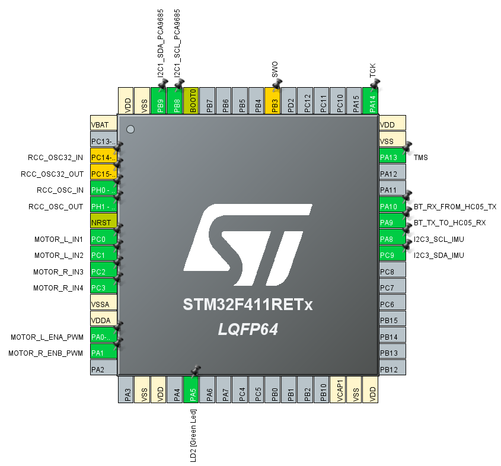

# NUCLEO-F411RE 핀맵

현재 `.ioc`와 펌웨어 기준입니다.

## STM32 핀 배치

## 최종 배선도

## I2C1

| 장치 핀 | STM32 | 조건 |
|---|---|---|
| PCA9685 SCL | PB8 | `I2C1_SCL_PCA9685` |
| PCA9685 SDA | PB9 | `I2C1_SDA_PCA9685` |

PCA9685 주소는 `0x40`, 통신 속도는 100 kHz입니다.

## I2C3

| 장치 핀 | STM32 | 조건 |
|---|---|---|
| MPU6050 SCL | PA8 | `I2C3_SCL_IMU` |
| MPU6050 SDA | PC9 | `I2C3_SDA_IMU` |
| MPU6050 AD0 | GND | 주소 `0x68` |
| MPU6050 INT | 미연결 | 20 ms polling |
| MPU6050 VCC | 실물 적용 | 공급전압 문서 미기록 |

통신 속도는 100 kHz입니다. 두 모듈의 pull-up과 논리 전압은 실물에서 각각
확인합니다.

## Bluetooth

| 기능 | STM32 | HC-05 |
|---|---|---|
| USART1 TX | PA9 | RXD |
| USART1 RX | PA10 | TXD |

설정은 9600 baud, 8-N-1입니다.

## L298N

| 기능 | STM32 | 역할 |
|---|---|---|
| ENA | PA0 / TIM2_CH1 | 왼쪽 20 kHz PWM |
| IN1 | PC0 | 왼쪽 방향 |
| IN2 | PC1 | 왼쪽 방향 |
| ENB | PA1 / TIM2_CH2 | 오른쪽 20 kHz PWM |
| IN3 | PC2 | 오른쪽 방향 |
| IN4 | PC3 | 오른쪽 방향 |

ENA/ENB 점퍼를 제거합니다. 좌우 전진 극성은 실제 L298N·모터 배선에 맞춰 적용했습니다.

## 기타

| 기능 | 핀 |
|---|---|
| SWD | PA13, PA14 |
| 예비 | PA2, PA3 |

## 전원·GND

- PCA9685 `VCC`: STM32 논리 전원.
- PCA9685 `V+`: XL4015 서보 전원.
- PCA9685 `V+`–GND: 1000 µF 전해 커패시터.
- 차량용 2S: L298N 모터 전원.
- STM32, PCA9685, L298N, HC-05, MPU6050과 두 전원은 공통 GND.
- 서보·모터 고전류 귀환은 STM32 보드를 경유하지 않음.
- STM32 VIN용 DC-DC는 실물 적용 완료. 모델·출력값은 문서 미기록.
