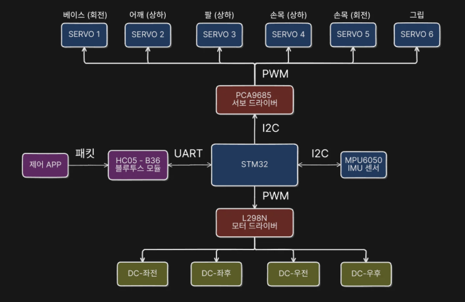

# PCA9685와 S-curve 서보 제어

이 문서는 로봇팔의 목표 자세가 PCA9685 PWM 출력으로 변환되는 과정과
서보를 부드럽게 움직이는 5차 S-curve를 설명합니다. 발표 자료의 제어 흐름을
참고하되, 수치와 채널은 현재 펌웨어를 기준으로 합니다.



## 전체 흐름

```text
앱의 목표 자세와 속도
  → 16바이트 Bluetooth 패킷
  → 5차 S-curve 궤적 계산
  → 20 ms마다 다음 관절 위치 계산
  → 관절별 3점 보정으로 펄스폭 변환
  → 펄스폭을 PCA9685 12비트 Count로 변환
  → I2C1 레지스터 기록
  → 서보 PWM 출력
```

## PCA9685 역할

STM32의 타이머 채널을 서보마다 사용하지 않고 PCA9685 한 개가 6개 서보의
PWM을 생성합니다. 모든 채널은 같은 50 Hz 주기를 사용하지만 펄스폭은 채널마다
독립적으로 설정합니다.

| 항목 | 현재 설정 |
|---|---|
| 연결 | I2C1 PB8/PB9, 100 kHz |
| 주소 | `0x40` |
| PWM 주파수 | 50 Hz |
| PWM 주기 | 20,000 µs |
| 분해능 | 12비트, 4,096 Count |
| Prescale | 121 |
| 사용 채널 | 0~5 |

| 채널 | 관절 |
|---:|---|
| 0 | Base |
| 1 | Shoulder |
| 2 | Elbow |
| 3 | Wrist Tilt |
| 4 | Wrist Rotate |
| 5 | Gripper |

Canva의 `1056 µs → 216 Count`는 변환 과정을 보여주는 예시입니다. 실제 Shoulder
출력은 현재 채널 1을 사용하며, 펄스폭은 저장된 관절 보정값에 따라 달라집니다.

### I2C 통신 방식

STM32가 Master, PCA9685가 Slave입니다. SCL은 STM32가 만드는 클록이고 SDA는
주소·레지스터·데이터를 주고받는 선입니다. 두 선은 Open-drain 방식이므로 pull-up이
필요합니다. 실제 모듈의 pull-up 저항값은 문서에 기록되지 않아 임의로 지정하지
않습니다.

PCA9685의 7비트 주소는 `0x40`입니다. I2C 버스에서는 이 주소 뒤에 Read/Write
비트가 붙습니다.

```text
7비트 장치 주소 : 0x40 = 100 0000₂
Write 주소 바이트: 0x80 = 1000 0000₂
Read 주소 바이트 : 0x81 = 1000 0001₂
```

STM32 HAL은 주소 인수에 Read/Write 비트가 들어갈 자리를 포함하므로 코드에서는
`0x40 << 1`, 즉 `0x80`을 `HAL_I2C_Mem_Write()`에 전달합니다. HAL이 실제 전송
방향에 맞춰 최하위 비트를 처리합니다.

한 채널을 기록하는 순서는 다음과 같습니다.

```text
START
  → PCA9685 주소 + Write
  → ACK
  → 시작 레지스터 주소
  → ACK
  → ON_L → ACK → ON_H → ACK → OFF_L → ACK → OFF_H → ACK
  → STOP
```

`MODE1`의 Auto Increment를 켰기 때문에 시작 레지스터 하나를 지정한 뒤 네 바이트를
연속 전송할 수 있습니다. 펌웨어의 `HAL_I2C_Mem_Write()`가 START, 주소, ACK 확인,
레지스터 주소와 데이터 전송, STOP을 처리합니다. ACK가 없거나 100 ms 안에 전송이
끝나지 않으면 오류를 반환합니다.

### 채널 레지스터

채널마다 ON 시점과 OFF 시점을 저장하는 네 레지스터가 있습니다.

| 순서 | 레지스터 | 내용 |
|---:|---|---|
| 0 | `LEDn_ON_L` | ON Count 하위 8비트 |
| 1 | `LEDn_ON_H` | ON Count 상위 4비트, Full ON 비트 |
| 2 | `LEDn_OFF_L` | OFF Count 하위 8비트 |
| 3 | `LEDn_OFF_H` | OFF Count 상위 4비트, Full OFF 비트 |

채널 0의 시작 주소는 `0x06`이고, 다음 채널은 네 바이트 뒤에 있습니다.

```text
채널 n 시작 주소 = 0x06 + 4 × n

채널 0 Base          : 0x06
채널 1 Shoulder      : 0x0A
채널 2 Elbow         : 0x0E
채널 3 Wrist Tilt    : 0x12
채널 4 Wrist Rotate  : 0x16
채널 5 Gripper       : 0x1A
```

### 12비트 카운터

12비트는 `2¹² = 4096`단계를 표현합니다. 내부 카운터는 한 PWM 주기 동안
`0~4095`를 반복합니다. Count가 ON 값에 도달하면 출력이 활성화되고 OFF 값에
도달하면 비활성화됩니다.

```text
Count: 0 ───────────────────────────────────────────── 4095
       ↑ ON=0                 ↑ OFF=N
       └────── HIGH 구간 ─────┘
```

현재 펌웨어는 모든 채널의 ON Count를 0으로 두고 OFF Count만 바꿉니다. 따라서
OFF Count가 곧 펄스폭을 나타냅니다. ON과 OFF 값을 모두 다르게 주면 펄스의 시작
위치도 옮길 수 있지만, 일반 서보 제어에는 필요하지 않아 사용하지 않습니다.

### 펄스폭을 Count로 변환

20,000 µs를 4,096등분하므로 한 Count는 약 4.883 µs입니다.

```text
OFF Count = round(펄스폭 µs × 4096 / 20000)
```

예를 들어 1,500 µs는 307 Count이고 `0x0133`입니다. Shoulder 채널 1에 이를
출력하면 시작 주소 `0x0A`부터 다음 네 바이트를 기록합니다.

```text
LED1_ON_L  = 0x00
LED1_ON_H  = 0x00
LED1_OFF_L = 0x33
LED1_OFF_H = 0x01
```

Canva의 1,056 µs 예시는 같은 식으로 약 216 Count가 됩니다.

```text
round(1056 × 4096 / 20000) = 216
```

상위 레지스터에는 Count의 상위 4비트만 저장합니다. 비트 4는 일반 Count가 아니라
Full ON 또는 Full OFF 제어 비트입니다. 전체 출력 차단 시에는
`ALL_LED_OFF_H`의 Full OFF 비트를 사용합니다.

### 50 Hz와 Prescale

PCA9685의 모든 채널은 하나의 PWM 주파수를 공유합니다. 내부 발진기의 대표값
25 MHz를 사용할 때 주파수와 Prescale 관계는 다음과 같습니다.

```text
PWM 주파수 = 발진 주파수 / (4096 × (Prescale + 1))
Prescale = round(발진 주파수 / (4096 × 목표 주파수)) - 1

50 Hz 설정 = round(25,000,000 / (4096 × 50)) - 1 ≈ 121
```

대표 발진값으로 계산하면 `Prescale=121`에서 약 50.03 Hz입니다. 실제 내부 발진기는
오차가 있으므로 정확한 펄스폭이 필요하면 출력 주기를 측정하고 서보 3점 보정값에
반영합니다.

### 각도를 펄스폭으로 변환

서보마다 중앙과 양 끝의 실제 펄스폭이 다르므로 하나의 고정 비율을 사용하지
않습니다. `-90°`, `0°`, `+90°`에서 저장한 세 점을 두 구간으로 나눠 선형
보간합니다.

```text
-90° ~ 0°  : 최소 펄스 ↔ 중앙 펄스
  0° ~ 90° : 중앙 펄스 ↔ 최대 펄스
```

앱의 일반 관절 `-90~+90°`는 패킷 내부의 `0~180`으로 전달됩니다. Gripper는
앱의 열림 `0%`부터 닫힘 `100%`를 내부 `0~180`으로 변환합니다. 조립 방향이
반대인 관절은 펄스 변환 전에 논리 위치를 반전합니다.

보정 가능한 범위는 일반 관절 `350~2650 µs`, Gripper `1000~2000 µs`입니다.
실측값은 [서보 보정 문서](servo-calibration.md)를 기준으로 합니다.

### 초기화와 출력 차단

1. I2C 장치 응답 확인.
2. `MODE1`을 읽고 Auto Increment와 Sleep 설정.
3. `PRE_SCALE=121` 기록.
4. Sleep 해제 후 1 ms 대기.
5. Restart와 Totem-pole 출력 설정.
6. 부팅 직후 모든 채널을 Full OFF로 유지.

PCA9685 통신은 전용 `i2cMutex`로 보호합니다. I2C 기록에 실패하면 로봇팔
출력을 차단하고 상위 태스크가 1초 간격으로 재초기화를 시도합니다.

## 5차 S-curve

목표 각도를 즉시 PWM에 적용하면 속도와 가속도가 갑자기 변해 충격, 기구 흔들림,
전류 피크가 커질 수 있습니다. 현재 펌웨어는 위치를 5차 다항식으로 만들고 20 ms
간격으로 조금씩 출력합니다.

```text
p(t) = a0 + a1t + a2t² + a3t³ + a4t⁴ + a5t⁵
```

계수는 다음 경계 조건을 만족하도록 계산합니다.

- 시작: 현재 위치, 현재 속도, 현재 가속도.
- 종료: 목표 위치, 속도 0, 가속도 0.

정지 상태에서 출발하는 기본 형태는 정규화 시간 `u=t/T`에 대해 다음과 같습니다.

```text
s(u) = 10u³ - 15u⁴ + 6u⁵,  0 ≤ u ≤ 1
p(t) = 시작 위치 + (목표 위치 - 시작 위치) × s(u)
```

`T`는 전체 이동 시간입니다. `u`는 현재 경과 시간 `t`를 `T`로 나눈 값입니다.
따라서 시작과 끝에서는 변화량이 작고 중간에서는 커져, 느리게 출발하고 가속한 뒤
목표 근처에서 다시 감속합니다.

### 속도와 이동 시간

앱 속도는 `50~100%`입니다. 최대 각속도는 다음 식을 사용합니다.

```text
최대 각속도 = 1000 / 16 × 속도 비율
             = 62.5 × 속도 비율 (°/s)
```

| 앱 속도 | 최대 각속도 |
|---:|---:|
| 50% | 약 31.25°/s |
| 80% | 약 50.0°/s |
| 100% | 약 62.5°/s |

가속 기준 시간은 `12 × 20 ms = 240 ms`입니다. 펌웨어는 이 값으로 최대
가속도와 저크를 계산합니다.

```text
최대 가속도 = 최대 각속도 / 0.24
최대 저크   = 최대 가속도 / 0.24
```

이동 시간은 고정값이 아닙니다. 20 ms부터 시작해 후보 시간을 25%씩 늘리며,
6개 관절이 모두 위치 범위와 속도·가속도·저크 제한을 지키는 가장 짧은 시간을
선택합니다. 후보 하나는 32개 구간으로 검사하며 모든 관절이 같은 시점에 끝납니다.

### 이동 중 목표 변경

새 목표가 들어오면 현재 위치뿐 아니라 현재 속도와 가속도도 시작 조건으로 사용해
새 5차 궤적을 만듭니다. 연속 궤적이 관절 범위를 벗어나면 현재 위치에서 속도와
가속도를 0으로 만든 뒤 다시 계획합니다. 지연된 20 ms 호출을 한꺼번에 실행하지
않아 I2C 출력이 순간적으로 몰리는 것도 막습니다.

## 제어의 한계

- 일반 서보에는 위치 피드백이 없어 현재 위치는 마지막 명령값입니다.
- S-curve는 명령 변화를 부드럽게 하지만 전원 부족, 전압 강하, 기구 걸림을
  해결하지는 않습니다.
- 끝점은 서보와 조립 상태마다 다르므로 앱에서 실측 보정해야 합니다.
- PCA9685의 실제 발진 오차가 크면 오실로스코프로 주기와 펄스폭을 확인한 뒤
  보정값을 다시 측정합니다.

## 구현 위치

- PCA9685 초기화·출력: `firmware/mobile_retrieval_robot/App/Src/servo_driver.c`
- S-curve·관절 제어: `firmware/mobile_retrieval_robot/App/Src/robot_arm.c`
- 실측 펄스: `docs/hardware/servo-calibration.md`
- 핀과 전원: `docs/hardware/pin-map.md`
- 발표 자료: [Canva 프레젠테이션](https://canva.link/0yyf17uj8df1qjl)
- 칩 규격: [NXP PCA9685 데이터시트](https://www.nxp.com/docs/en/data-sheet/PCA9685.pdf)
