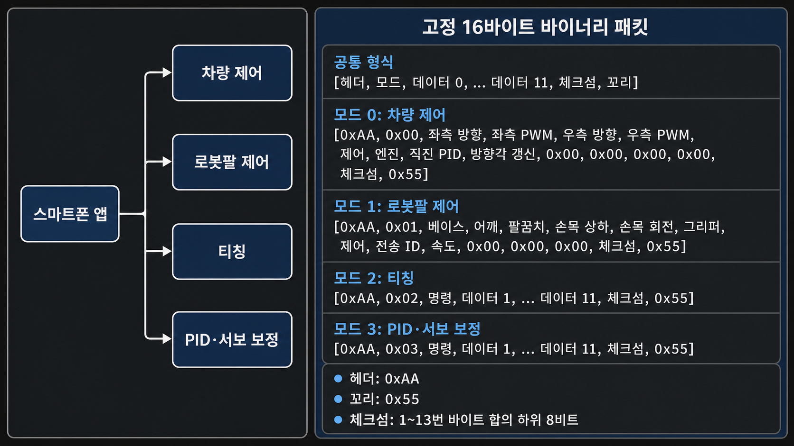

# Bluetooth 16바이트 프로토콜

Flutter 앱과 STM32 펌웨어의 기준 규격입니다.

- UART: 9600 baud, 8-N-1.
- 고정 16바이트 바이너리. ASCII 명령은 사용하지 않음.
- 구현: `app/lib/protocol/robot_packet.dart`,
  `firmware/mobile_retrieval_robot/App/Src/bluetooth.c`.

## 통합 통신 프로토콜 요약



고정 16바이트 바이너리 패킷을 사용합니다.

```text
공통 형식
[헤더, 모드, 데이터 0, ... 데이터 11, 체크섬, 꼬리]

모드 0: 차량 제어
[0xAA, 0x00, 좌측 방향, 좌측 PWM, 우측 방향, 우측 PWM,
 제어, 엔진, 직진 PID, 방향각 갱신, 0x00, 0x00, 0x00, 0x00,
 체크섬, 0x55]

모드 1: 로봇팔 제어
[0xAA, 0x01, 베이스, 어깨, 팔꿈치, 손목 상하, 손목 회전, 그리퍼,
 제어, 전송 ID, 속도, 0x00, 0x00, 0x00, 체크섬, 0x55]

모드 2: 티칭
[0xAA, 0x02, 명령, 데이터 1, ... 데이터 11, 체크섬, 0x55]

모드 3: PID·서보 보정
[0xAA, 0x03, 명령, 데이터 1, ... 데이터 11, 체크섬, 0x55]
```

- 헤더: `0xAA`
- 꼬리: `0x55`
- 체크섬: 1~13번 바이트 합의 하위 8비트

## 공통 프레임

```text
[Header, Mode, Data0, ... Data11, Checksum, Tail]
```

| Byte | 값 |
|---:|---|
| 0 | Header `0xAA` |
| 1 | Mode: `0` Drive, `1` Arm, `2` Teaching, `3` Settings |
| 2~13 | Data0~Data11 |
| 14 | Byte 1~13 합의 하위 8비트 |
| 15 | Tail `0x55` |

Header, Tail, Mode, Checksum 또는 Mode별 범위가 틀리면 전체 프레임을 폐기합니다.

## Mode 0: Drive

```text
[AA,00,L_DIR,L_PWM,R_DIR,R_PWM,Control,Engine,PidStraight,RefreshYaw,
 00,00,00,00,checksum,55]
```

| 필드 | 값 |
|---|---|
| `L_DIR`, `R_DIR` | `0` 전진, `1` 후진 |
| `L_PWM`, `R_PWM` | `0~255` |
| `Control` | `0` 일반, `1` E-STOP, `2` E-STOP 해제 |
| `Engine` | `0` 정지, `1` 주행 |
| `PidStraight` | `0/1` 상대 Yaw PID 요청 |
| `RefreshYaw` | `0/1` 현재 Yaw를 목표로 갱신 |

검증:

- Data8~Data11은 `0`.
- `Engine=0`이면 PWM과 PID 필드도 `0`.
- PID는 좌우 방향이 같고 PWM이 하나 이상 0보다 클 때만 허용.
- `RefreshYaw=1`은 `PidStraight=1`일 때만 허용.
- E-STOP 설정·해제 프레임의 방향, PWM, Engine과 PID 필드는 `0`.

앱은 주행 중 약 100 ms마다 전송합니다. 펌웨어는 500 ms 동안 유효한 명령이
없거나 다른 Mode로 바뀌면 정지합니다. 역전은 한 프레임의 중립 정지 뒤
적용합니다. 인터록 해제 전 프레임은 재사용하지 않습니다.

### E-STOP ACK

```text
[AA,00,Control,Status,Reason,00,00,00,00,00,00,00,00,00,checksum,55]
```

앱은 해제 ACK의 `Status=1`을 받은 뒤 잠금을 해제합니다.

### PID·IMU 상태

250 ms마다 두 종류를 번갈아 보내며 각 종류는 약 500 ms마다 갱신됩니다.

```text
PID: [AA,00,03,Flags,TargetYawL,TargetYawH,CurrentYawL,CurrentYawH,
      ErrorL,ErrorH,OutputL,OutputH,LeftPwm,RightPwm,checksum,55]
IMU: [AA,00,04,Flags,TempL,TempH,GyroZL,GyroZH,YawL,YawH,
      ErrorCount0,ErrorCount1,ErrorCount2,ErrorCount3,checksum,55]
```

- PID Flags: bit0 명령, bit1 PID 활성, bit2 연산 중, bit3 후진,
  bit4 목표 갱신, bit5 IMU 사용 가능.
- PID 각도·출력: signed int16 little-endian, ×100.
- PWM: 실제 적용된 `0~255`.
- IMU Flags: bit0 초기화, bit1 보정, bit2 최신값 유효.
- 온도·Gyro Z·Yaw: signed int16 little-endian, ×100.
- 오류 횟수: unsigned int32 little-endian.

앱은 1.5초 이상 갱신되지 않은 상태를 오래된 값으로 처리합니다.

## Mode 1: Arm

```text
[AA,01,Base,Shoulder,Elbow,WristTilt,WristRotate,Gripper,
 Control,TransactionId,Speed,00,00,00,checksum,55]
```

| Data | 값 |
|---:|---|
| 0~4 | 앱 각도 `-90~+90°`에 90을 더한 `0~180` |
| 5 | Gripper `0~100%`를 변환한 `0~180` |
| 6 | `0` 이동, `1` 원점 활성화, `2` 출력 차단, `3` 시퀀스 9 |
| 7 | Transaction ID `1~255` |
| 8 | 속도 `50~100%` |
| 9~11 | `0` |

규칙:

- 원점: `[90,90,90,90,90,0]`.
- `Control=3`: Data0~Data5는 `0`; Flash 시퀀스 9를 현재 Gripper 유지 상태로 재생.
- 출력 활성화 전 이동 거부.
- 한 관절이라도 범위를 벗어나면 전체 자세 거부.
- 수동 명령은 티칭 재생 중지.
- 이동·재생 중 차량 인터록.
- 위치는 실측값이 아니라 마지막 명령값.

### ACK

```text
[AA,01,Command,Status,Reason,TransactionId,00,00,00,00,00,00,00,00,
 checksum,55]
```

| Reason | 의미 |
|---:|---|
| 0 | 성공 |
| 1 | 값 오류 |
| 2 | 미보정 관절 |
| 3 | 출력 비활성 |
| 4 | 다른 동작 중 |
| 5 | PCA9685 오류 |
| 6 | 성공했지만 설정 속도 보장 불가 |

일반 이동 성공 ACK는 목표 도착 후 보냅니다. 앱은 같은 Transaction ID만
완료로 인정하며 10초 안에 응답이 없으면 E-STOP을 요청합니다.

## Mode 2: Teaching

12개 시퀀스, 시퀀스당 최대 30개 웨이포인트를 사용합니다.

| 시퀀스 | 이름 | 변경 |
|---:|---|---|
| 1~8 | 사용자 지정 | 가능 |
| 9 | 이동 자세 | 불가 |
| 10 | 잡기 위치 | 불가 |
| 11 | 잡기 | 불가 |
| 12 | 놓기 | 불가 |

이름은 UTF-8 `1~21`바이트입니다. 앱은 9~12번을 잠금 아이콘과 용도별 색으로
구분하며 펌웨어도 고정 이름이 아니면 업로드를 거부합니다.

### 재생

```text
요청: [AA,02,02,Sequence,Speed,00,00,00,00,00,00,00,00,00,checksum,55]
응답: [AA,02,02,Sequence,Status,SpeedWarning,00,00,00,00,00,00,00,00,
       checksum,55]
```

- Sequence `1~12`, Speed `50~100`.
- 빈 시퀀스와 중복 재생은 거부.
- 부팅 시 자동 재생하지 않음.
- `SpeedWarning=1`은 안전 재계획으로 일부 구간의 설정 속도를 보장하지 못함.

### 초기화

```text
요청: [AA,02,03,Sequence,00,00,00,00,00,00,00,00,00,00,checksum,55]
응답: [AA,02,03,Sequence,Status,00,00,00,00,00,00,00,00,00,checksum,55]
```

RAM과 Flash를 비우며 앱은 `Status=1`에서만 목록을 삭제합니다.

### 업로드

```text
START:  [AA,02,04,01,Sequence,Count,NameLength,00,00,00,00,00,00,00,
         checksum,55]
NAME:   [AA,02,04,05,Sequence,Part,N0,N1,N2,N3,N4,N5,N6,N7,checksum,55]
FIRST:  [AA,02,04,02,Sequence,Index,A0,A1,A2,00,00,00,00,00,checksum,55]
SECOND: [AA,02,04,03,Sequence,Index,A3,A4,A5,00,00,00,00,00,checksum,55]
COMMIT: [AA,02,04,04,Sequence,00,00,00,00,00,00,00,00,00,checksum,55]
ACK:    [AA,02,04,Sequence,Status,00,00,00,00,00,00,00,00,00,checksum,55]
```

- Count `1~30`, Index `0~Count-1`.
- NameLength `1~21`, Part `0~2`; NAME은 8바이트씩 보내고 남는 바이트는 `0`.
- A0~A4는 관절 `0~180`, A5는 Gripper `0~180`.
- 모든 NAME·FIRST·SECOND 조각이 있어야 COMMIT 허용.
- Sector 7 기록 후 전체 내용을 다시 비교.

업로드·재생·초기화 중 앱은 화면 전환과 관련 데이터 수정을 잠급니다.

### 편집본 임시 재생

앱은 START·NAME·FIRST·SECOND로 현재 편집본을 임시 버퍼에 보낸 뒤 COMMIT 대신
다음 명령을 전송합니다.

```text
요청: [AA,02,07,Sequence,Speed,00,00,00,00,00,00,00,00,00,checksum,55]
응답: Mode 2 재생 응답과 동일
```

완전한 조각만 재생하며 Sector 7은 변경하지 않습니다. 차량 화면에서 실행하는
시퀀스 9~12는 이 명령이 아닌 Mode 2 재생 명령으로 Flash 저장본을 사용합니다.

### 저장 시퀀스 조회

```text
요청:     [AA,02,06,Sequence,RequestId,00,00,00,00,00,00,00,00,00,
           checksum,55]
메타:     [AA,02,06,Sequence,00,Count,RequestId,00,00,00,00,00,00,00,
           checksum,55]
웨이포인트: [AA,02,06,Sequence,01,Index,A0,A1,A2,A3,A4,A5,RequestId,00,
             checksum,55]
```

앱은 메타와 Count개의 웨이포인트를 모두 받은 경우에만 화면을 바꿉니다. 다른
시퀀스를 선택할 때 미저장 편집본을 버리고 이 조회 결과로 교체합니다.

### 이름 조회

```text
요청: [AA,02,05,Sequence,RequestId,00,00,00,00,00,00,00,00,00,checksum,55]
응답: [AA,02,05,Sequence,Part,NameLength,RequestId,N0,N1,N2,N3,N4,N5,N6,
       checksum,55]
```

응답은 UTF-8 이름을 7바이트씩 전송합니다. 앱은 같은 Sequence, RequestId,
NameLength의 모든 조각을 받은 뒤에만 이름을 갱신합니다.

## Mode 3: Settings

### 53바이트 설정

| Byte | 형식 | 값 |
|---:|---|---|
| 0~3 | int32 LE | Kp ×1000, `0~2550`, 10의 배수 |
| 4~7 | int32 LE | Ki ×1000, `0~100000` |
| 8~11 | int32 LE | Kd ×1000, `0~100000` |
| 12~47 | uint16 LE ×18 | 관절별 `-90/0/+90°` 펄스 |
| 48~52 | uint8 ×5 | 호환용 이동 자세, 실행에는 미사용 |

- 일반 관절 펄스 `350~2650 µs`.
- Gripper 열림·닫힘 `1000~2000 µs`; 중앙은 평균.
- 앱 PID 범위: Kp `0.00~2.55`, Ki/Kd `0~100`.
- 초기 PID: `2.00/1.40/0.00`; 자동 활성화하지 않음.
- 실행 이동 자세는 설정 필드가 아닌 티칭 시퀀스 9.

### 조회

```text
요청: [AA,03,01,RequestId,00,00,00,00,00,00,00,00,00,00,checksum,55]
응답: [AA,03,04,Part,PidApplied,B0,B1,B2,B3,B4,B5,B6,B7,RequestId,
       checksum,55]
```

Part `0~6`. 각 조각은 8바이트이며 마지막 3바이트는 0으로 채웁니다. 앱은 같은
Request ID의 7개 조각을 모두 받아야 값을 갱신합니다.

### 저장

```text
조각: [AA,03,02,Part,B0,B1,B2,B3,B4,B5,B6,B7,B8,B9,checksum,55]
확정: [AA,03,03,53,CrcLow,CrcHigh,00,00,00,00,00,00,00,00,checksum,55]
ACK:  [AA,03,03,Status,Reason,PidApplied,00,00,00,00,00,00,00,00,
       checksum,55]
```

- Part `0~5`; 마지막 조각은 유효 3바이트 뒤를 0으로 채움.
- CRC-16/CCITT-FALSE: init `0xFFFF`, poly `0x1021`.
- 모든 조각과 CRC가 맞아야 기록.

| Reason | 의미 |
|---:|---|
| 0 | 성공 |
| 1 | 조각 누락 |
| 2 | CRC 오류 |
| 3 | 서보 보정·호환 필드 오류 |
| 4 | 로봇팔 동작 중 |
| 5 | Flash 기록·검증 오류 |
| 6 | PID 실행 중 계수 변경 |
| 7 | PID 범위 오류 |

### IMU 영점 보정

```text
요청: [AA,03,08,RequestId,00,00,00,00,00,00,00,00,00,00,checksum,55]
응답: [AA,03,08,Status,Reason,RequestId,00,00,00,00,00,00,00,00,
       checksum,55]
```

- PID 활성화 전에 차량을 정지하고 3초 동안 영점을 다시 측정합니다.
- Reason `0` 성공, `1` IMU 사용 불가, `2` 보정 진행 중, `3` 측정 오류.
- 보정 중 차량 명령은 적용하지 않으며 완료 뒤 새 주행 명령만 사용합니다.

### PID 활성화

```text
요청: [AA,03,07,Enable,RequestId,00,00,00,00,00,00,00,00,00,checksum,55]
응답: [AA,03,07,Status,PidApplied,Reason,RequestId,00,00,00,00,00,00,00,
       checksum,55]
```

- Enable `0/1`.
- Reason `0` 성공, `1` IMU·안전 상태 불가, `2` PID 계수 무효.
- 전환 전 차량 정지.
- 앱은 MPU6050 3초 보정 ACK를 받은 뒤 활성화를 요청.
- E-STOP에서 PID 비활성화.

### 서보 미리보기

```text
요청: [AA,03,05,Joint,PulseLow,PulseHigh,Speed,RequestId,
       00,00,00,00,00,00,checksum,55]
응답: [AA,03,05,Joint,Status,Reason,PulseLow,PulseHigh,RequestId,
       00,00,00,00,00,checksum,55]
종료: [AA,03,06,00,00,00,00,00,00,00,00,00,00,00,checksum,55]
```

- Joint `0~5`, Speed `50~100`, RequestId `1~255`.
- 일반 관절 `350~2650 µs`, Gripper `1000~2000 µs`.
- 선택 관절만 S-curve 이동하고 다른 채널은 원점 유지.
- 최신 Request ID의 도착 ACK 전 선택 변경·저장 금지.
- 목표 도착 후 2초간 새 요청이 없거나 종료 명령을 받으면 미리보기 종료.
- 미리보기 중 차량 인터록. 후보값은 저장 명령 전까지 앱 RAM에만 유지.

## 스트림 처리

USART1 RX는 128바이트 circular DMA입니다.

1. 태스크가 DMA write 위치까지 새 바이트를 읽습니다.
2. `0xAA`부터 16바이트를 모아 전체 검증합니다.
3. 유효 프레임만 제어 큐로 전달합니다.
4. 무효 프레임은 다음 `0xAA`에서 재동기화합니다.
5. UART 오류 콜백은 플래그만 남기고 태스크가 DMA를 재시작합니다.
6. ISR에서는 파싱, 장치 제어와 Flash 작업을 하지 않습니다.
